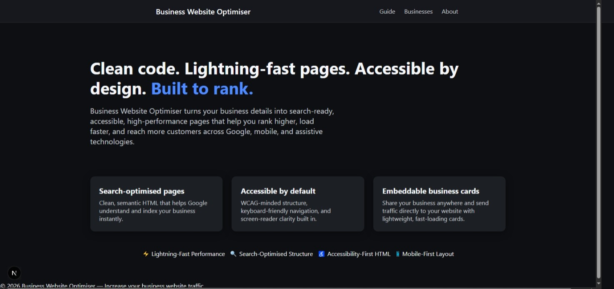
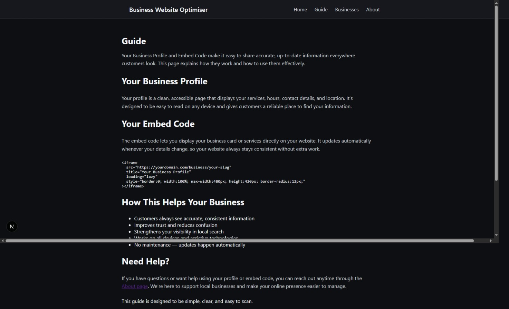
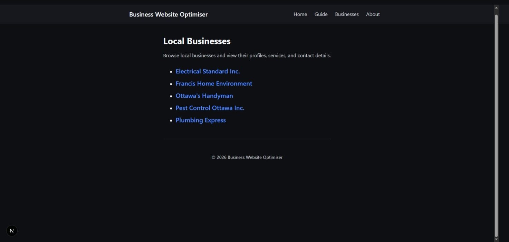
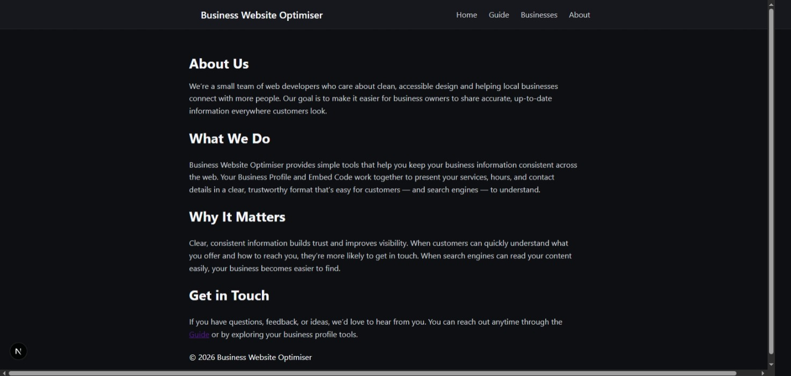

# Business Website Optimiser

Business Website Optimiser is a fast, accessibility‑first platform that turns local business details into clean, search‑optimised, high‑performance web pages.  
It focuses on semantic HTML, WCAG‑minded structure, and mobile‑first layouts to help businesses rank higher and reach more customers.

---

## 🚀 Features

- **Lightning‑fast, SEO‑optimised pages**  
  Clean semantic markup designed for Google indexing and Core Web Vitals.

- **Accessibility‑first architecture**  
  WCAG‑minded structure, keyboard‑friendly navigation, and screen‑reader clarity.

- **Embeddable business cards**  
  Lightweight, iframe‑ready cards that can be embedded on any website.

- **Local business directory**  
  Browse and view published businesses with consistent, accessible layouts.

- **Supabase‑powered backend**  
  Real‑time data, secure storage, and scalable business profiles.

---

## 📸 Screenshots

### **Homepage**

### **Guide**

### **Businesses Directory**

### **About Profile**

---

## 🧱 Tech Stack

- **Next.js 14 (App Router)**
- **React**
- **Supabase**
- **TypeScript**
- **CSS Modules / Custom Styles**
- **Vercel Deployment**

---

## 📂 Project Structure

